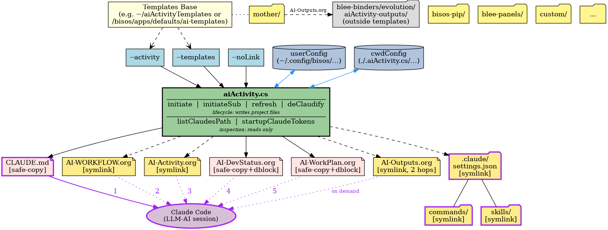
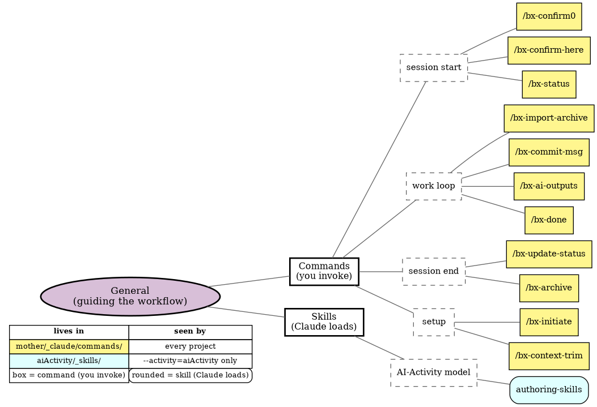
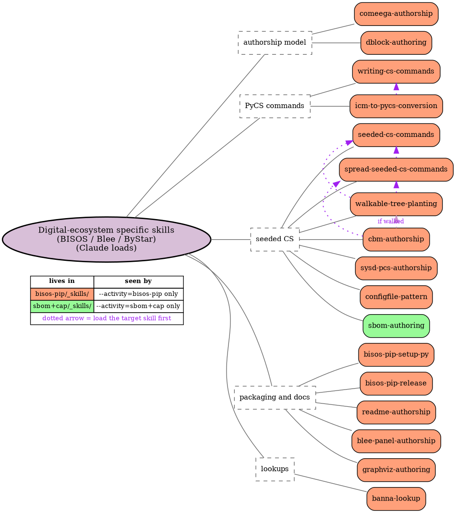
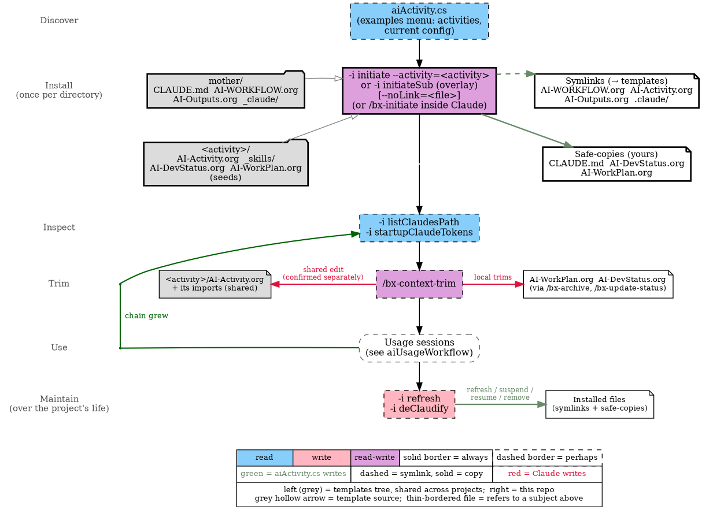

#+title: bisos.aiActivity: For Managing Your AI-Activity
#+DATE: <2026-07-12 Sat>
#+AUTHOR: Mohsen BANAN
#+OPTIONS: toc:4

#+BEGIN: b:org:pypi:readme/topControls :pkgName "aiActivity" :comment "basic"

|----------------------+------------------------------------------------------------------|
| ~Blee Panel Controls~: | [[elisp:(show-all)][Show-All]] : [[elisp:(org-shifttab)][Overview]] : [[elisp:(progn (org-shifttab) (org-content))][Content]] : [[elisp:(delete-other-windows)][(1)]] : [[elisp:(progn (save-buffer) (kill-buffer))][S&Q]] : [[elisp:(save-buffer)][Save]]  : [[elisp:(kill-buffer)][Quit]]  : [[elisp:(bury-buffer)][Bury]] |
| ~Panel Links~:         | [[file:./py3/panels/bisos.aiActivity/_nodeBase_/fullUsagePanel-en.org][Repo Blee Panel]] --  [[file:/bxRepos/bisos-pip/aiActivity/py3/panels/bisos.aiActivity/_nodeBase_/fullUsagePanel-en.org][Blee Panel]]                                   |
| ~See Also~:            | [[https://pypi.org/project/bisos.aiActivity][At PYPI]] : [[https://github.com/bisos-pip/pycs][bisos.PyCS]]                                             |
|----------------------+------------------------------------------------------------------|

#+END:

* The Concept and Model of an AI-Activity

An *AI-Activity* is a durable, collaborative effort between a human and
an AI assistant (Claude Code) toward a specific purpose --- writing a
document, building new software, enhancing existing software, and so on.
Unlike a one-shot chat, an activity is expected to span many sessions,
possibly across machines and over long stretches of time. Its state,
conventions, and progress live in files under version control rather
than in any one session's memory.

Two org-mode files encode the activity, playing distinct roles:

- =AI-Activity.org= describes the human's *usual way of doing that kind
  of work* --- their conventions, preferred libraries, patterns, and
  gotchas. It is *reusable*: symlinked from a shared activity template
  so the same conventions apply to every project of that kind. Examples
  of concrete activities: =bisos-pip= (Python package authorship),
  =xu-single= (single-XU PyCS scripts), =blee-panels= (Blee panel
  authorship), =lcnt= (LaTeX content).
- =AI-WorkPlan.org= describes *this specific effort* --- what will be
  built or written, broken into stages with TODOs. It is per-effort:
  edited freely, org-archived as work completes, and paired with
  =AI-DevStatus.org= which records where the effort stands right now.

Activities are classes of work; WorkPlans are instances. The templates
=/bisos.aiActivity/= installs are what encode this distinction on
disk --- shared invariants and activity conventions are symlinked from a
templates repo (so improvements propagate); WorkPlan and DevStatus start
as safe-copies (so each effort owns its own state).

* Collaboration Across People and Across Sessions

The default mode of AI-assisted development today is *individualistic*.
Every new Claude Code session starts empty and re-explains its context
from scratch. A colleague picking up your work can read the code, but
not how you have been collaborating with Claude on it --- the
conventions, the running plan, the reasoning behind the last decision.
That information exists only in the session that produced it, and
disappears when the session ends.

An AI-Activity is collaborative in two symmetric senses that address
this directly. It is *human-to-human* --- one person starts the
activity, a colleague continues it later, possibly on a different
machine. And it is *human-to-AI* --- one Claude Code session begins the
work, another resumes it hours or weeks later with no memory of the
earlier one. Both are the same problem: *continuity across a
discontinuity*. The state, conventions, and open TODOs must live in
files that a fresh reader --- human or AI --- can pick up cold.

That substrate is *org-mode*, deliberately, not Markdown. Org-mode
provides what handoffs and resumptions actually need: TODOs with a real
state machine (=TODO=/=DONE=/=WAITING=/=DEFERRED=), scheduled dates and
deadlines, named anchors (=<<my-target>>=) that other files can
cross-reference, org-archive to retire completed subtrees without losing
history, and *dynamic blocks* (=begin:= ... =end:=) --- machine-generated
regions inside an otherwise hand-edited file, used here to capture
install-time context into the installed files.
Markdown can only approximate these through ad-hoc convention.
The AI-Activity model relies on the structure being real --- not
implied --- so that a colleague or a fresh Claude session can act on
=AI-WorkPlan.org= and =AI-DevStatus.org= with the same reliability the
original author had.

*Emacs is not required.* This tooling is Emacs-authored and its
authors' own use is Emacs-based (via Blee), but org-mode files are
plain text and read equally well in VS Code, IntelliJ, or any editor.
Claude Code itself is editor-agnostic. The commitment is to org-mode as
a file format, not to Emacs as an environment.

* Why AI-Activity, Not Chatbot?

The chatbot has quietly become the default interface for AI. Every
session starts fresh, the conversation is the unit of work, and the
interface funnels users toward whatever the model chooses to surface.
This is not a neutral choice. [[https://doi.org/10.1145/3805689.3812232][/What if AI systems weren't chatbots?/]]
is a peer-reviewed argument that the chatbot paradigm systematically
erodes user agency, deskills its users, and homogenizes knowledge ---
harms that task-specific, workflow-integrated AI systems largely
avoid. The *AI-Activity* is our move toward [[https://en.wikipedia.org/wiki/Tools_for_Conviviality][/convivial tools/]] ---
shaped by their user rather than the reverse --- and away from the
industrial default.

The industrial default has concrete faces. Google's Gemini Notebook
(formerly NotebookLM) is its most sympathetic form: you supply your
documents, it grounds its answers in them, and your notebook persists
across sessions. That solves the amnesia problem --- but within Google's
platform, Google's structure, Google's UI. Claude's Plan mode is a
subtler case: Claude reasons before acting, shows you a plan, and waits
for approval. That is a better chatbot, not a different paradigm ---
the plan is Claude's, the structure is Claude's, and the session ends
with nothing durable on your filesystem. Both are improvements on the
raw chatbot; neither transfers ownership of the workflow to the human.
The AI-Activity model does: the plan lives in your =AI-WorkPlan.org=,
the conventions live in your =AI-Activity.org=, everything is in your
git repo, and the AI works within the structure you define.

This requires choosing a foundation that supports it. AI belongs inside
a cumulative, convivial, collaborative environment --- not on top of an
industrial one. Unix is convivial; Windows is industrial. Git is
inherently collaborative. Org-mode is a far richer collaborative
substrate than Markdown. Build a base of Linux + Git + org-mode first
--- then shape AI usage within it. Our own use is Emacs-based via
[[https://github.com/bisos-pip/b][Blee]]; yours need not be.

What follows is the concrete mechanics of that inversion --- and the
templates tree is where the accumulated result of that inversion lives.

* The Templates as Collaborative, Cumulative Domain Knowledge

=aiActivity.cs= is the delivery mechanism. The compounding value is in the
templates tree.

Each =AI-Activity.org= file encodes the conventions, constraints, and
context for a specific kind of work --- Python packaging, LaTeX authorship,
security analysis, site administration. A fresh Claude session in any
directory that inherits that file immediately works within those conventions,
without re-explanation.

The symlink machinery is what makes this collaborative rather than
individualistic. Installed projects symlink to the shared =AI-Activity.org=
in the canonical templates tree. When anyone refines that file --- correcting
a convention, adding a new constraint, capturing a hard-won lesson --- every
project symlinked to it inherits the improvement automatically, at the next
Claude session, with no per-project action required. Refinement is a shared
act; the benefit is collective.

The collection also grows across dimensions: new activities cover new domains;
forks encode conventions for different organizations or contexts. The
[[https://github.com/bxexamples/aiActivityTemplates][bxexamples/aiActivityTemplates]] repository is the public reference fork ---
a starting point for those who want to contribute back or build their own
canonical tree. But the default relationship is inheritance, not isolation:
one canonical tree, many projects drawing from it, knowledge compounding
in one place.

The =AI-Activity.org= files are the primary artifact.
=aiActivity.cs= installs them; Claude reads them; collaborators refine them.
That cycle --- shared, cumulative, and version-controlled --- is the point.
What it looks like once it has accumulated is shown, using our own BISOS
templates, in [[#templates][Templates]].

* Overview

/bisos.aiActivity/ installs the ByStar AI collaborative development
template set --- =CLAUDE.md=, =AI-WORKFLOW.org=,
=AI-Activity.org=, =AI-DevStatus.org=, =AI-WorkPlan.org=, plus a =.claude/=
directory with =settings.json=, =commands/=, and optionally =skills/= ---
into a project directory, git repo root, or subproject.

This package is *just the execution engine* --- the template content lives
in a separately-cloned repo
([[https://github.com/bxexamples/aiActivityTemplates]], or your own fork).
See [[#two-part-architecture-execution-engine--templates][Two-Part Architecture]] below for details.

The installed layout is *hierarchical and Claude-consumable*. Files fall
into two classes:

- *Invariants*, symlinked from =mother/= (=CLAUDE.md=,
  =AI-WORKFLOW.org=, =.claude/settings.json=, =.claude/commands/=).
  Because they are symlinks to a shared source, an edit to =mother/=
  propagates automatically to every project that has been =initiate=-d
  against that templates base.
- *Activity-specific* files, from =<activity>/= (=AI-Activity.org=
  symlinked; =AI-DevStatus.org= and =AI-WorkPlan.org= safe-copied and
  editable; optionally =.claude/skills/= symlinked from
  =<activity>/_skills/= for on-demand task-specific instructions).

Claude Code consumes this hierarchy automatically. On startup it walks
upward from the current working directory collecting every =CLAUDE.md=,
which in turn imports (imports =AI-WORKFLOW.org= +
=AI-Activity.org= + =AI-DevStatus.org= + =AI-WorkPlan.org= via =@=
directives). Nested subprojects installed with =initiateSub= use a slim
=CLAUDE.md= that imports only the local trio; the invariants are
inherited from an ancestor via the same walk-up, avoiding duplication.

The lasting value is in the templates tree: each =AI-Activity.org= distils
domain-specific conventions that any Claude session in that context inherits
immediately. The commands below manage that inheritance.

The templates are meant to be mimicked, and they come in two kinds:
- *General* ones that drive the workflow: the =/bx-*= slash commands and
  general skills. They are the same for everyone; take them as-is.
- *Digital-ecosystem specific* skills that encode an organization's ways
  of doing things. Ours are BISOS / Blee / ByStar's; build your own
  equivalent.

Both are shown, with our tree as the example, in [[#templates][Templates]].

bisos.aiActivity is a python package that uses the [[https://github.com/bisos-pip/pycs][PyCS-Framework]].
It provides the =aiActivity.cs= command with the following operations:
=userConfig_set/get= (global user persistent config), =cwdConfig_set/get=
(per-directory persistent config), =cwdConfig_record= (deduce
per-directory config from local symlinks and record it), =initiate= (base
install), =initiateSub= (slim subproject overlay), =refresh= (re-copy =CLAUDE.md= from
templates), =deClaudify= (permanent removal), and =examples= (all
invocations with the current templates base and cwdConfig state). A
comprehensive command table appears under
[[#table-of-commands][Table of Commands]] in Usage.

** Structure at a Glance

The figure below shows how the pieces fit together --- one static
picture of everything =bisos.aiActivity= consumes and produces,
from templates at the top to a Claude Code session at the bottom.
The colours and edge styles carry meaning; scan the legend first,
then the figure.

*Legend:*

| Element                 | Meaning                                                                 |
|-------------------------+-------------------------------------------------------------------------|
| Yellow fill             | Symlink to templates. Upstream edits propagate.                         |
| Pink fill               | Safe-copy. Per-project, yours to edit.                                  |
| Solid engine → file     | Safe-copy write.                                                        |
| Dashed engine → file    | Symlink write.                                                          |
| Blue bidirectional edge | Read/write of a persistent store (=userConfig=, =cwdConfig=).           |
| Purple edge, numbered   | Claude reads this file at startup. =1= = walk-up to CLAUDE.md; =2=--=5= = imports. |
| Purple edge, "on demand" | Claude reads this file only when needed; it is not imported.          |
| Purple outline          | Claude binding (specific to Claude Code). Everything else is agent-neutral. |
| Grey fill               | Outside the templates tree (another repo).                              |

*Reading the figure, top to bottom:*

- *Templates layer.* The templates base (e.g. =~/aiActivityTemplates=)
  contains =mother/= (invariants shared by every activity) alongside
  the activity directories (=bisos-pip/=, =blee-panels/=, =custom/=,
  ...). One dotted connector from base to =mother/= stands in for the
  same relationship to every other child. =mother/AI-Outputs.org= is
  itself a symlink /out/ of the templates tree, into a separate
  blee-binders repo (grey). This keeps the growing ledger's churn out
  of the templates.
- *Parameters layer.* =--activity=, =--templates=, =--noLink= are
  CLI inputs; =userConfig= and =cwdConfig= are persistent stores that
  supply the same values when the CLI flags are omitted.
- *Engine.* =aiActivity.cs=, in two compartments. The six
  *lifecycle* commands write project files. The two *inspection*
  commands, =listClaudesPath= and =startupClaudeTokens=, only read
  them. All parameter inputs converge here.
- *Generated files.* What lands in the project directory when
  =initiate= runs. Seven items --- six org files plus =.claude/=
  (containing =settings.json=, =commands/=, =skills/=).
  =AI-Outputs.org= is a two-hop symlink: project → =mother/= →
  blee-binders.
- *Claude Code (bottom).* The consumer. On startup Claude Code walks
  up from your working directory, finds =CLAUDE.md= (edge *1*), and
  follows its =@= imports out to the four org files (edges *2*
  through *5*). =AI-Outputs.org= is not imported; Claude reads it on
  demand, via =/bx-ai-outputs= or when a task calls for it.
- *Purple outlines.* =CLAUDE.md=, =.claude/= with its
  subdirectories, and the Claude Code node make up the /Claude
  binding/: the only parts specific to Claude Code. See
  [[#claude-specificity-agent-neutral-content-claude-binding][Claude Specificity]].

* Table of Contents     :TOC:
- [[#the-concept-and-model-of-an-ai-activity][The Concept and Model of an AI-Activity]]
- [[#collaboration-across-people-and-across-sessions][Collaboration Across People and Across Sessions]]
- [[#why-ai-activity-not-chatbot][Why AI-Activity, Not Chatbot?]]
- [[#the-templates-as-collaborative-cumulative-domain-knowledge][The Templates as Collaborative, Cumulative Domain Knowledge]]
- [[#overview][Overview]]
  - [[#structure-at-a-glance][Structure at a Glance]]
- [[#part-of-bisos--bystar-internet-services-operating-system][Part of BISOS — ByStar Internet Services Operating System]]
- [[#bisosaiactivity-is-a-command-only-pycs-facility][bisos.aiActivity is a Command-Only PyCS Facility]]
- [[#two-part-architecture-execution-engine--templates][Two-Part Architecture: Execution Engine + Templates]]
  - [[#part-1-----the-execution-engine-this-package][Part 1 --- the execution engine (this package)]]
  - [[#part-2-----the-templates-a-separate-repo-you-clone][Part 2 --- the templates (a separate repo you clone)]]
  - [[#auto-detection-two-canonical-locations][Auto-detection: two canonical locations]]
- [[#templates][Templates]]
  - [[#general-workflow-commands-and-skills][General: Workflow Commands and Skills]]
  - [[#digital-ecosystem-specific-bisos--blee--bystar-skills][Digital-Ecosystem Specific: BISOS / Blee / ByStar Skills]]
- [[#claude-specificity-agent-neutral-content-claude-binding][Claude Specificity: Agent-Neutral Content, Claude Binding]]
- [[#dynamic-block-content-in-installed-files][Dynamic Block Content in Installed Files]]
- [[#post-installation-setup][Post-Installation Setup]]
  - [[#for-non-bisos-users-canonical-clone-no-config-step][For non-BISOS users: canonical clone, no config step]]
  - [[#for-bisos-users-nothing-to-do-usually][For BISOS users: nothing to do (usually)]]
- [[#installation][Installation]]
  - [[#installation-with-pip][Installation With pip]]
  - [[#installation-with-pipx][Installation With pipx]]
  - [[#post-installation-basic-testing][Post-Installation Basic Testing]]
- [[#usage][Usage]]
  - [[#self-discovery-the-examples-menu][Self-Discovery: the examples Menu]]
  - [[#the-session-workflow-at-a-glance][The Session Workflow at a Glance]]
  - [[#table-of-commands][Table of Commands]]
  - [[#set-templates-base-directory][Set Templates Base Directory]]
  - [[#per-directory-templates-override][Per-Directory Templates Override]]
  - [[#install-templates-into-a-project][Install Templates Into a Project]]
  - [[#install-a-subproject-overlay][Install a Subproject Overlay]]
  - [[#customizing-a-shared-template-file---nolink][Customizing a Shared Template File: =--noLink=]]
  - [[#skills][Skills]]
  - [[#refresh-claudemd-from-templates][Refresh CLAUDE.md From Templates]]
  - [[#remove-ai-collaboration-files][Remove AI Collaboration Files]]
  - [[#ai-activity-topology-homogeneous-heterogeneous-hierarchical-lateral][AI-Activity Topology: Homogeneous, Heterogeneous, Hierarchical, Lateral]]
    - [[#homogeneous-vs-heterogeneous][Homogeneous vs Heterogeneous]]
    - [[#hierarchical-vs-lateral][Hierarchical vs Lateral]]
  - [[#inspect-the-startup-context-startupclaudetokens][Inspect the Startup Context: =startupClaudeTokens=]]
- [[#key-files][Key Files]]
    - [[#aiactivitycs][aiActivity.cs]]
    - [[#startupclaudetokens_csupy][startupClaudeTokens_csu.py]]
    - [[#pypi-and-github-packaging][PyPi and Github Packaging]]
- [[#documentation-and-blee-panels][Documentation and Blee-Panels]]
  - [[#bisosaiactivity-blee-panels][bisos.aiActivity Blee-Panels]]
- [[#support][Support]]
- [[#planned-improvements][Planned Improvements]]

* Part of BISOS — ByStar Internet Services Operating System

Layered on top of Debian, *BISOS* (By* Internet Services Operating System)
is a unified and universal framework for developing both internet services and
software-service continuums that use internet services. See
[[https://github.com/bxGenesis/start][Bootstrapping ByStar, BISOS and Blee]]
for information about getting started with BISOS.

*BISOS* is a foundation for *The Libre-Halaal ByStar Digital Ecosystem* which
is described as a cure for losses of autonomy and privacy in a book titled:
[[https://github.com/bxplpc/120033][Nature of Polyexistentials]]

/bisos.aiActivity/ is part of BISOS. It is a standalone package that can
be used independently of the full BISOS environment.

Within BISOS and Blee specifically, the same org-mode substrate that
underpins the AI-Activity state files extends further --- to source-code
authorship itself --- through *COMEEGA* (Collaborative Org-Mode Enhanced
Emacs Generalized Authorship). Under COMEEGA, =.cs= / =.py= / =.sh= /
=.el= source files carry org-mode structure (dblocks, headings,
docstrings-as-org) alongside the native language, so the workflow's
authorship idiom runs continuously from planning through implementation
to documentation. COMEEGA is a BISOS/Blee integration detail; outside
Blee the source files still work as ordinary Python (etc.), and the AI
Activity model itself does not depend on COMEEGA.

* bisos.aiActivity is a Command-Only PyCS Facility

bisos.aiActivity is a command-line tool. It is a PyCS single-unit
command service. PyCS is a framework that converges development of CLI tools
and services. PyCS is an alternative to FastAPI, Typer and Click.

bisos.aiActivity uses the PyCS-Framework to:

1) Install AI collaborative development templates (symlinks and safe-copies)
   from a *templates repo you clone separately* (see *Two-Part Architecture*
   below) into any project directory, git repo root, or subproject.
2) Expand =b:ai:file/particulars= org-mode dynamic blocks in installed files
   using pure Python, without requiring Emacs or =bx-dblock=.
3) Manage persistent user-config parameters (e.g. the templates-clone path)
   via =~/.config/bisos/aiActivity.cs/=.

The core of PyCS-Framework is the /bisos.b/ package (the PyCS-Foundation).
See [[https://github.com/bisos-pip/b][bisos.b]] for an overview.

* Two-Part Architecture: Execution Engine + Templates

/bisos.aiActivity/ is deliberately split into two independently
versioned parts. Understanding this split is essential before installing.

** Part 1 --- the execution engine (this package)

This =bisos.aiActivity= pip package contains only the *execution
engine* --- the =aiActivity.cs= command and its supporting Python
modules. It knows how to symlink, copy, expand dblocks, and manage user
config, but it *ships with no template content*.

** Part 2 --- the templates (a separate repo you clone)

The template content --- the =mother/= baseline files plus one directory
per activity (=bisos-pip/=, =xu-single/=, =blee-panels/=, =lcnt/=, ...) ---
lives in a separate repo:

[[https://github.com/bxexamples/aiActivityTemplates]]

*This is where the value accumulates.* Each =AI-Activity.org= file in
this repo encodes the conventions, constraints, and hard-won lessons for
a specific domain of work. The engine (Part 1) is stable infrastructure;
the templates tree is the living knowledge base that grows over time,
across projects, and across collaborators.

Clone it (or fork it) somewhere on your filesystem, then point
=aiActivity.cs= at it via user config (see *Post-Installation Setup* below).

Because the templates are versioned separately from the engine, you can:

- *Refine shared conventions* --- improve an =AI-Activity.org= once and
  every project symlinked to it inherits the improvement at the next
  Claude session, with no per-project action. Knowledge compounds in
  one place.
- *Customize for your own context* --- fork =bxexamples/aiActivityTemplates=,
  add your own activities or adjust =mother/=, and point =aiActivity.cs=
  at your fork. Your organization's conventions are encoded once and
  available everywhere.
- *Update engine and templates independently* --- =pipx upgrade
  bisos.aiActivity= and =git pull= on your templates clone are two
  separate operations with separate cadences.

What a templates tree contains, with ours as the example, is shown in
[[#templates][Templates]] below.

The split has a second, orthogonal seam: between the agent-neutral
content and the Claude-specific loader. See *Claude Specificity* below.

** Auto-detection: two canonical locations

=aiActivity.cs= probes two well-known locations *in this order* and
persists the first one that exists as the default templates base:

1. =~/aiActivityTemplates= --- the canonical per-user clone path. If you
   =git clone https://github.com/bxexamples/aiActivityTemplates
   ~/aiActivityTemplates= (or forked and cloned your fork to that
   name), the engine finds it automatically.
2. =/bisos/apps/defaults/ai-templates= --- the BISOS-provisioned system
   path. Present on BISOS systems out of the box.

If neither exists, no default is set and the user must run
=userConfig_set --parName=templates --parValue=<path>= explicitly.

The precedence is *user-first, system-second*: a personal clone at
=~/aiActivityTemplates= wins over the BISOS path even when both are
present. This lets a user working on a BISOS system point the engine at
their own fork simply by cloning it to the canonical name, with no
=userConfig_set= call needed.

* Templates

The engine is only as good as the templates tree behind it. Below is
what our own tree, the BISOS templates, contains on the commands-and-skills
side, as two trees: what you take as-is, and what you build your own
equivalent of. In both trees, fill colour shows where each item lives in
the templates tree, which is also which projects see it.

** General: Workflow Commands and Skills

*Take it as-is.* The =/bx-*= commands that drive a session, and general
skills such as =authoring-skills=. They guide the workflow and are the
same for everyone. The commands live in =mother/=, so every project gets
them. How a session uses them is shown under
[[#the-session-workflow-at-a-glance][The Session Workflow at a Glance]].

** Digital-Ecosystem Specific: BISOS / Blee / ByStar Skills

*Build your own equivalent.* The BISOS / Blee / ByStar ways of doing
things, written down as skills that Claude loads when a task calls for
them. There are seventeen skills in five areas, some building on others
(dotted arrows: "load this one first"), each placed in the activity whose
projects need it.

You will not use these skills; they encode /our/ ecosystem. The pattern is
what transfers. Your organization has its own equivalents: an authorship
model, a command framework, packaging and release rules, internal lookups.
Write them down the same way, as skills grouped by area and placed in the
activities whose projects need them, and every project initiated from your
templates gets them. This is the work that makes the templates valuable.
The engine only delivers it.

* Claude Specificity: Agent-Neutral Content, Claude Binding

The AI-Activity model is not tied to any particular AI assistant. In
practice, though, /bisos.aiActivity/ has only been used with Claude
Code, and every point where it touches the assistant is specific to
Claude Code. It is worth being precise about where that line falls.

*Agent-neutral --- the content and the engine's logic:*

- =AI-WorkPlan.org=, =AI-DevStatus.org=, =AI-Activity.org=,
  =AI-Outputs.org= --- plain org-mode files that any assistant, or any
  human, can read and act on.
- The templates tree --- the =mother/= baseline plus activity
  overlays, and which files are symlinked (shared) versus safe-copied
  (owned by the project).
- The lifecycle logic --- =initiate=, =initiateSub=, =refresh=,
  =deClaudify= --- together with the config
  stores, provenance, and dblock expansion. Only the file names they
  handle are Claude's.

*The Claude binding --- how that content gets loaded:*

- =CLAUDE.md= is the entry file, and its =@= imports are what pull in
  the four org files.
- =.claude/= holds =settings.json= (Claude Code's permissions format),
  =commands/= (the =/bx-*= slash commands), and =skills/=.
- The design relies on three Claude Code behaviors:
  - it resolves symlinks before reading --- hence =CLAUDE.md= is
    safe-copied, not symlinked
  - it loads every ancestor's =CLAUDE.md= --- which is what lets an
    =initiateSub= overlay inherit its parent's =AI-WORKFLOW.org= and
    =.claude/=
  - it loads subdirectory =CLAUDE.md= files only on demand
- Commands that exist only because of this binding say so in their
  name: =deClaudify=, =listClaudesPath=, =startupClaudeTokens=.

*Only the Claude binding exists today.* A binding for another assistant
would need three things from it: an entry file it loads automatically,
ancestor walk-up (for =initiateSub=), and an import mechanism. The file
names are the easy part. Imports are the real dependency: without them,
the entry file would have to be generated by concatenating the org
files, and that gives up the property that editing a shared template
updates every project at its next session.

The policy is to *isolate the binding, not abstract it*:
Claude-specific commands are named as such, and the Claude-specific
names are kept in one place in the code, but there is no =--agent=
option until a second assistant is actually in use.

* Dynamic Block Content in Installed Files

When =initiate= safe-copies =AI-DevStatus.org= and =AI-WorkPlan.org=,
the copies contain a =b:ai:file/particulars= dynamic block that is
expanded at install time to record the working directory, activity, and
companion docs --- the context a cold reader (colleague or fresh Claude
session) needs to orient itself.

The block is a snapshot: not regenerated by =refresh= or any normal
workflow. The dblock engine itself lives in a separate package,
[[https://github.com/bisos-pip/pyDblock][=bisos.pyDblock=]], which
=bisos.aiActivity= consumes at install time. Manual regeneration
and authoring of new dblock signatures are documented there.

* Post-Installation Setup

** For non-BISOS users: canonical clone, no config step

The zero-config path:

#+begin_src bash
git clone https://github.com/bxexamples/aiActivityTemplates ~/aiActivityTemplates
#+end_src

That's it. The engine auto-detects =~/aiActivityTemplates= on first
invocation and persists it as the templates base. You can verify:

#+begin_src bash
aiActivity.cs -i userConfig_get --parName=templates
#+end_src

If you prefer a different path, clone there instead and run
=userConfig_set= explicitly:

#+begin_src bash
git clone https://github.com/bxexamples/aiActivityTemplates /some/other/path
aiActivity.cs -i userConfig_set --parName=templates --parValue=/some/other/path
#+end_src

If you later want to customize the templates for your own conventions,
fork the repo, edit your fork, and (if you cloned to a non-canonical
path) re-point =--parValue= at the fork.

** For BISOS users: nothing to do (usually)

BISOS provisions =/bisos/apps/defaults/ai-templates= as part of the
environment, and the engine auto-detects it. No clone or config step
needed.

To override with a personal fork on a BISOS system, either clone the
fork to =~/aiActivityTemplates= (which then takes precedence) or run
=userConfig_set= with an explicit path.

* Installation

The sources for the bisos.aiActivity pip package are maintained at:
https://github.com/bisos-pip/aiActivity.

The bisos.aiActivity pip package is available at PYPI as
https://pypi.org/project/bisos.aiActivity

You can install bisos.aiActivity with pip or pipx.

** Installation With pip

If you need access to bisos.aiActivity as a python module, you can
install it with pip:

#+begin_src bash
pip install bisos.aiActivity
#+end_src

** Installation With pipx

If you only need access to bisos.aiActivity on command-line, you can
install it with pipx:

#+begin_src bash
pipx install bisos.aiActivity
#+end_src

The following commands are made available:

- =aiActivity.cs= — installs AI collaborative development templates

** Post-Installation Basic Testing

After installation, run:

#+begin_src bash
aiActivity.cs
aiActivity.cs -i userConfig_get --parName=templates
#+end_src

The first line invokes =aiActivity.cs= with no arguments and
produces the *examples menu* --- the self-documenting list of common
invocations, generated from the current environment (resolved templates
base, persisted =userConfig= and =cwdConfig= values, discovered
activities). See
[[#self-discovery-the-examples-menu][Self-Discovery: the =examples= Menu]]
below for what to look for in the output.

* Usage

** Self-Discovery: the examples Menu

Like every PyCS csxu, =aiActivity.cs= is *self-documenting* --- running
it with no arguments produces a menu of the common expected CLI
invocations for this csxu:

#+begin_src bash
aiActivity.cs
#+end_src

The menu is not static. It is generated at invocation time from the
csxu's own definition and from the *current environment*:

- Persistent params (=templates=, =activity=) are read from
  =userConfig= and =cwdConfig= and echoed in the menu as
  =# current: <value>= comments, so you can see at a glance what
  will apply.
- The =initiate= / =initiateSub= chapters iterate the actual set of
  activities discovered under the resolved templates base, so the menu
  reflects what is really installable right now.
- When cwdConfig has an =activity= set, an additional chapter
  =initiate/initiateSub Based on CWD Setting= appears at the end,
  showing the bare (zero-flag) invocations that are enabled by the
  persisted state.

The =examples= command produces the same output --- =aiActivity.cs=
with no =-i <cmnd>= implicitly invokes it:

#+begin_src bash
aiActivity.cs -i examples
#+end_src

Reading the =examples= menu is the recommended first step in any
directory --- it is the fastest way to see what is currently configured
and what invocations are available. All subsections below describe the
same commands the menu advertises; this section is the *narrative*
counterpart to that menu.

** The Session Workflow at a Glance

Once a project is set up, work happens in Claude Code sessions driven by
the =/bx-*= slash commands that =initiate= installs. The figure shows a
typical session:
1. *Session start*: confirm the context.
2. *Work loop*, once per TODO: work on the TODO, commit, capture findings,
   mark it done.
3. *Session end*: update the status, perhaps archive.

The column on the right shows what each step writes.

[[file:py3/images/fromTemplates/aiUsageWorkflow.png]]

Two things worth noticing:
- *Only "Work" touches your repo content.* Every =/bx-*= command manages
  the AI-collaboration state: WorkPlan, DevStatus, AI-Outputs.
- *Claude never commits.* =/bx-commit-msg= writes only the message file;
  =git add= and =git commit= are yours (the dashed black arrow).

=AI-Outputs.org= sits on the left because it is outside this repo: one
ledger shared by every project.

The figure draws only the writes. The table gives the full map: what each
step reads (R) and writes (W).

# Copied from bisos/defaults ai-templates/_nonTemplate_/images/aiUsageWorkflow.org
# (the source, next to the figure). Refresh together with fromTemplates/*.png.
| Step                           | Repo content | Repo git         | AI-WorkPlan.org (+ =_archive=) | AI-DevStatus.org | AI-Outputs.org |
|--------------------------------+--------------+------------------+--------------------------------+------------------+----------------|
| =/bx-confirm0=                 |              |                  | R                              | R                |                |
| =/bx-confirm-here=             |              |                  | R                              | R                |                |
| =/bx-status=                   |              |                  | R                              | R                |                |
| =/bx-import-archive=           |              |                  | R (=_archive=)                 |                  |                |
| Work on the selected TODO      | RW           |                  | R                              |                  |                |
| /You:/ =git add=, =git commit= | R            | W                |                                |                  |                |
| =/bx-commit-msg=               | R (staged)   | W (message only) |                                |                  |                |
| =/bx-ai-outputs= (index)       |              |                  |                                |                  | R              |
| =/bx-ai-outputs= (capture)     |              |                  |                                |                  | W              |
| =/bx-done <anchor>=            |              |                  | W                              |                  |                |
| =/bx-update-status=            |              |                  | R                              | W                |                |
| =/bx-archive=                  |              |                  | RW (+ W =_archive=)            |                  |                |

The confirm commands actually read the whole =CLAUDE.md= import chain.
The table shows only the per-project files that change.

** Table of Commands

The command surface falls into two groups. *Config commands* read and
write the two persistent stores (userConfig for machine-wide defaults;
cwdConfig for per-directory overrides). *Lifecycle commands* install,
manage, and remove AI-collaboration state in a project directory.

*Config commands:*

| Command             | Store     | Purpose                                                                     |
|---------------------+-----------+-----------------------------------------------------------------------------|
| =userConfig_get=    | userConfig| Read a global persistent value (=~/.config/bisos/aiActivity.cs/fps/=). |
| =userConfig_set=    | userConfig| Write a global persistent value. Typically used for =templates=.            |
| =cwdConfig_get=     | cwdConfig | Read a per-directory persistent value (=./.aiActivity.cs/fps/=).       |
| =cwdConfig_set=     | cwdConfig | Write a per-directory persistent value. Overrides userConfig for that dir.  |
| =cwdConfig_record=  | cwdConfig | Deduce =templates= + =activity= from local symlinks; write to cwdConfig. Retrofits directories initiated before cwdConfig auto-persist. |

*Lifecycle commands:*

| Command         | Purpose                                                                    | Notable options       |
|-----------------+----------------------------------------------------------------------------+-----------------------|
| =initiate=      | Install AI-collaboration templates into cwd (base install).                | =--activity=, =--templates=, =--noLink=<file>= |
| =initiateSub=   | Install a slim subproject overlay in cwd (requires an =initiate=-d parent).| =--activity=, =--templates=, =--noLink=<file>= |
| =refresh=       | Re-copy safe-copied invariants (currently =CLAUDE.md=) from templates.     |                       |
| =deClaudify=      | Permanently remove all AI-collaboration files. Irreversible; warns first if =AI-DevStatus.org= / =AI-WorkPlan.org= are not committed. |                       |
| =examples=        | Print the self-documenting examples menu. Default when no =-i= is passed.  |                       |

*Inspection commands* (read-only; both are part of the Claude binding ---
see [[#claude-specificity-agent-neutral-content-claude-binding][Claude Specificity]]):

| Command               | Purpose                                                                    |
|-----------------------+----------------------------------------------------------------------------|
| =listClaudesPath=     | Walk up from cwd to git repo root; list each =CLAUDE.md= + resolved =AI-Activity.org= target, cwd flush-left and each ancestor indented one step further. |
| =startupClaudeTokens= | Estimate the tokens Claude Code loads at session start from cwd, per source, following =@= imports. See [[#inspect-the-startup-context-startupclaudetokens][Inspect the Startup Context]]. |

The =--noLink=<file>= option on =initiate= / =initiateSub= converts a
would-be symlink into a safe-copy for the named file. See
[[#customizing-a-shared-template-file---nolink][Customizing a Shared
Template File]] below for when to use it.

Both =initiate= and =initiateSub= *auto-record* the templates base
and activity actually used into cwdConfig on success, so subsequent
invocations in the same directory (=refresh=, or a second =initiate= after =deClaudify=) can run with
no CLI flags.

** Set Templates Base Directory

Set the global (machine-wide) default once:

#+begin_src bash
aiActivity.cs -i userConfig_set --parName=templates --parValue=/path/to/ai-templates
#+end_src

This writes to =~/.config/bisos/aiActivity.cs/fps/templates/value= and
applies whenever you invoke =aiActivity.cs= without a =--templates=
override.

** Per-Directory Templates Override

For Heterogeneous AI-Activities — where different directories in the same
project (or on the same machine) use different template trees — set a
per-directory override with =cwdConfig_set=:

#+begin_src bash
cd /path/to/your/project
aiActivity.cs -i cwdConfig_set --parName=templates --parValue=/path/to/other-templates
#+end_src

This writes to =./.aiActivity.cs/fps/templates/value= (hidden dotdir
in the current directory). When =aiActivity.cs= is run in that
directory, the per-directory value takes precedence over the global
user-config.

To read the per-directory value:

#+begin_src bash
aiActivity.cs -i cwdConfig_get --parName=templates
#+end_src

=cwdConfig_get= reads *only* the per-directory store (reports =(not set)=
if nothing is written there). =userConfig_get= reads *only* the global
store. The two commands are symmetric and independent; the caller
(=aiActivity.cs= itself, via =_resolveTemplatesBase=) is what
composes them into a precedence chain.

*Precedence chain* for =templates= resolution:
1. =--templates= CLI flag (explicit override for this single invocation)
2. =./.aiActivity.cs/fps/templates/value= (=cwdConfig_set=)
3. =~/.config/bisos/aiActivity.cs/fps/templates/value= (=userConfig_set=)
4. Auto-detect: =~/aiActivityTemplates= then =/bisos/apps/defaults/ai-templates=

*Implementation note.* The per-directory feature is provided by a
separate CSU, =bisos.b.cwdConfig_csu=, added to this csxu's =csuList=
alongside =bisos.b.userConfig_csu=. Any bisos-pip package that wants
either or both persistence flavors composes them the same way.

** Install Templates Into a Project

=initiate= always operates on the *current directory*. To install at a
different location (e.g. the git repo root), =cd= there first.

Simplest form — pass the activity on the CLI:

#+begin_src bash
aiActivity.cs -i initiate --activity=bisos-pip
#+end_src

On success, =initiate= *auto-persists* =activity= to cwdConfig at
=./.aiActivity.cs/fps/activity/value=. Subsequent invocations in
the same directory (=refresh=, or a second
=initiate= after =deClaudify=) can then run bare, no CLI flags needed:

#+begin_src bash
aiActivity.cs -i initiate           # activity read from cwdConfig
#+end_src

Alternatively, set =activity= explicitly with =cwdConfig_set= before
=initiate=:

#+begin_src bash
aiActivity.cs -i cwdConfig_set --parName=activity --parValue=bisos-pip
aiActivity.cs -i initiate           # no --activity needed
#+end_src

Available activities match subdirectories under the templates base (e.g.
=bisos-pip=, =bisos-core=, =xu-single=, =blee-panels=, =lcnt=). Run
=aiActivity.cs -i examples= to see all available activities. When
=activity= is already persisted in cwdConfig, the examples menu shows
the bare =initiate= invocation at the top of the =initiate= chapter.

=initiate= installs the following into the target directory: symlinks for
the constant files (=CLAUDE.md=, =AI-WORKFLOW.org=,
=AI-Activity.org=); safe-copies of the editable files (=AI-DevStatus.org=,
=AI-WorkPlan.org=, with =b:ai:file/particulars= dblocks expanded); and
symlinks under =.claude/= for =settings.json=, =commands/=, and =skills/=
(when the activity ships a =_skills/= directory). See the *Skills*
subsection below.

*The setup lifecycle.* =initiate= is one stage in the life of a setup. The
figure shows the whole lifecycle:
1. *Discover* activities with the =examples= menu.
2. *Install* from the templates tree (left, shared across projects) into
   this repo (right).
3. *Inspect* the startup chain with =listClaudesPath= and
   =startupClaudeTokens=.
4. *Trim* it with =/bx-context-trim=.
5. *Use* it (see the session workflow under [[#table-of-commands][Table of Commands]]).
6. *Maintain* it with =refresh= and =deClaudify=.

Green arrows are writes by =aiActivity.cs= (dashed = symlink, solid =
copy); red arrows are writes by Claude.

** Install a Subproject Overlay

For repos with nested loosely-related subprojects that each want their own
work plan and dev status without duplicating the invariant files
(=AI-WORKFLOW.org=, =.claude/=), use =initiateSub=:

#+begin_src bash
aiActivity.cs -i initiateSub --activity=bisos-pip
#+end_src

This installs only the subproject-specific state — a slim =CLAUDE.md=
(copied from =mother/initiateSub/CLAUDE.md=), =AI-Activity.org= and
=AI-Outputs.org= symlinks, and safe-copies of =AI-DevStatus.org= and
=AI-WorkPlan.org=. =AI-Outputs.org= is installed in every directory because
it is not imported, so the walk-up cannot supply a parent's copy. It does NOT
install =AI-WORKFLOW.org=, or =.claude/= — those are
inherited from an ancestor directory via Claude Code's =CLAUDE.md= walk-up.

*Preconditions* (=initiateSub= refuses if either fails):
1. An ancestor directory must have been =initiate=-d already (=initiateSub=
   walks up looking for a aiActivity-signature =CLAUDE.md= symlink).
2. The target directory must not already have a =CLAUDE.md=.

The =--activity= flag is required — a subproject may be a different
activity from its parent (e.g., a =blee-panels= subproject inside a
=bisos-pip= repo).

Nested =initiateSub= is supported: a subproject's =CLAUDE.md= satisfies
the walk-up precondition for a sub-subproject.

=refresh= and =deClaudify= work on subproject overlays. =refresh= detects
sub vs. base mode from an initiated ancestor's =AI-WORKFLOW.org= symlink,
and =initiateSub= follows that ancestor's templates base unless you
explicitly name another one (a Heterogeneous sub).

** Customizing a Shared Template File: =--noLink=

By default, =initiate= installs the invariant files (=CLAUDE.md=,
=AI-WORKFLOW.org=) and the activity's =AI-Activity.org= as *symlinks*
into the templates tree. This is the intended behavior for most
activities: it means an edit to =mother/CLAUDE.md= or an activity's
=AI-Activity.org= propagates instantly to every project that has been
=initiate=-d against that templates base.

Sometimes you want the opposite --- a project that owns its own copy
of one of these files, edits it freely, and doesn't affect the shared
template. The classic case is =--activity=custom=: a project whose
conventions are specific to itself and don't belong in a reusable
activity template.

Both =initiate= and =initiateSub= accept =--noLink=<filename>= to
override the default. When passed, the named file is safe-copied
instead of symlinked:

#+begin_src bash
aiActivity.cs -i initiate --activity=custom --noLink=AI-Activity.org
#+end_src

Or for a subproject overlay:

#+begin_src bash
aiActivity.cs -i initiateSub --activity=custom --noLink=AI-Activity.org
#+end_src

Result: =AI-Activity.org= in the target directory is a real file
(the developer owns it), not a symlink. Everything else --- =CLAUDE.md=,
=AI-WORKFLOW.org=, =.claude/= entries --- remains symlinked as usual.

Valid filenames for =--noLink= are files that =initiate= / =initiateSub=
would otherwise install as symlinks: =CLAUDE.md=, =AI-WORKFLOW.org=,
=AI-Activity.org=. Only one file at a time for now; multi-file support
will come via a =bisos.b= framework improvement later.

** Skills

When an activity ships a =_skills/= directory at its templates root,
=initiate= symlinks it to =.claude/skills/= alongside the other =.claude/=
entries. Claude Code discovers those skills automatically and loads them
on demand when the current task calls for them.

*Skills* are self-contained, filesystem-based packages of task-specific
instructions. Each skill is a folder containing a =SKILL.md= file whose
front-matter description tells Claude when to consult the full file. This
lets a repo carry deep procedural knowledge (how to write a CS command,
how to author a Blee panel, how to release to PyPI) without loading that
content on every session — the short descriptions sit in context by
default, and Claude reads the full skill only when it matches the task
at hand.

Skills come in two kinds:
- *General* ones that guide the workflow (e.g. =authoring-skills=).
- *Digital-ecosystem specific* ones that encode an organization's ways of
  doing things. Ours are the BISOS / Blee / ByStar skills, from
  =writing-cs-commands= and =dblock-authoring= to =bisos-pip-release=.

Both are drawn as trees, with where each one lives, in
[[#templates][Templates]].

To author a new skill, add a folder under the appropriate templates
directory:

- =mother/_skills/<name>/SKILL.md= — available to every activity
- =<activity>/_skills/<name>/SKILL.md= — activity-specific

Each =SKILL.md= starts with YAML front-matter (=---=-delimited) containing
=name:= and =description:= fields. The description drives when Claude
loads the skill; write it as a concrete trigger ("Use when writing or
modifying a PyCS =cs.Cmnd= subclass") rather than a topic label.

** Refresh CLAUDE.md From Templates

=CLAUDE.md= is safe-copied (not symlinked) at =initiate= / =initiateSub=
time. This is deliberate: Claude Code resolves symlinks before reading a
file, so any =@./AI-Activity.org= import inside a symlinked =CLAUDE.md=
would resolve against the templates directory instead of the current
project. Safe-copy pins =CLAUDE.md= to the project.

The tradeoff is that changes to =mother/CLAUDE.md= (or
=mother/initiateSub/CLAUDE.md=) in the templates directory don't
automatically propagate to already-installed projects. Use =refresh= to
pull in an updated CLAUDE.md:

#+begin_src bash
aiActivity.cs -i refresh
#+end_src

The command detects base vs sub mode by walking up for a parent
=AI-WORKFLOW.org= symlink under templatesBase: if found, sub mode
(re-copies from =mother/initiateSub/CLAUDE.md=); otherwise base
(=mother/CLAUDE.md=). Only =CLAUDE.md= is refreshed for now; per-project
files (=AI-DevStatus.org=, =AI-WorkPlan.org=, and files installed with
=--noLink=) are never touched.

=refresh= also upgrades legacy installs whose =CLAUDE.md= is still a
symlink from the pre-safe-copy era: it unlinks the symlink and copies in
its place.

** Remove AI Collaboration Files

To permanently remove all AI collaboration files from a project, use
=deClaudify=. It is irreversible --- it deletes the editable
=AI-DevStatus.org= and =AI-WorkPlan.org= files along with the symlinks and
=.claude/= entries. If you are only not using AI for a while, leave the files
where they are; they cost nothing until Claude is started there. Before
deleting, =deClaudify= warns if either file is untracked or modified
relative to git (or the directory is not in a repo), since git then has no
copy. A bare =initiate= afterwards restores everything else from cwdConfig.

#+begin_src bash
aiActivity.cs -i deClaudify
#+end_src

The command is safe: symlinks are only removed if they are actually symlinks,
and copied files are only removed if they are regular files. Anything a user
has created or converted manually is left intact.

** AI-Activity Topology: Homogeneous, Heterogeneous, Hierarchical, Lateral

AI-Activities have two independent structural dimensions. They can be
combined freely, and =aiActivity.cs= supports all combinations.

*** Homogeneous vs Heterogeneous

An *AI-Activity* is *Homogeneous* when every directory in a repo (and
every repo in a project) references the same templates base. All
participants share the same conventions, skills, and =mother/= invariants.
A typical example: a team developing Python pip packages where every
repo is =initiate=-d with =--activity=bisos-pip= against the same
=aiActivityTemplates= clone, and all LaTeX documentation subprojects use
=--activity=lcnt= from the same clone.

An *AI-Activity* is *Heterogeneous* when different directories or repos
reference *different* templates bases. A typical example: proprietary
pip packages are =initiate=-d against a private templates fork (with
company-specific conventions), while open-source packages in the same
workspace use the public =bxexamples/aiActivityTemplates= clone. Each
directory's =AI-WORKFLOW.org= symlink points to a different templates
tree, so a fresh Claude session in each picks up the correct conventions
automatically.

*Homogeneous is the default.* =initiateSub= (and =refresh=) in a
subdirectory of an initiated directory use that ancestor's templates base,
even when your global user-config names another tree. Heterogeneous is
always /explicit/: the =--templates= parameter (for a single invocation) or
the per-directory =.aiActivity.cs/fps/templates= override (see *Per-Directory
Templates Override* above) names the different tree, and =initiateSub=
reports =HETEROGENEOUS= and proceeds. Whether a directory is a base or a
sub is decided by its own =AI-WORKFLOW.org= symlink (base installs have one,
subs inherit the ancestor's), so a base install nested inside another
initiated project is still recognised as a base.

*** Hierarchical vs Lateral

An *AI-Activity* is *Hierarchical* when the work spans *nested
directories within one repo* (or a set of repos in a single filesystem
tree). The base directory is =initiate=-d; subdirectories that need their
own work plan and dev status are =initiateSub=-d. Claude Code's =CLAUDE.md=
walk-up stitches them together: a session in a subdirectory inherits the
base's =AI-WORKFLOW.org= and =.claude/= while carrying its own local
=AI-Activity.org=, =AI-DevStatus.org=, and =AI-WorkPlan.org=. A typical
example: a =bisos-pip= repo (base) with a =blee-panels= subproject
(sub-directory overlay).

An *AI-Activity* is *Lateral* when the work spans *multiple independent
repos* worked on in the same session or sprint — for example, a pip
package repo and its companion Blee-panel repo that live at the same
filesystem level and have no parent/child relationship. Each repo is
=initiate=-d independently. A Claude session that opens files across both
repos sees both =CLAUDE.md= files during its walk-up (one per repo
root), loading the correct conventions for each.

Homogeneous/Heterogeneous and Hierarchical/Lateral are orthogonal and
can be combined. A project can be Hierarchical in structure (base + subs)
and Heterogeneous in templates (different bases for different subtrees).

** Inspect the Startup Context: =startupClaudeTokens=

Everything a session loads at startup is paid for on every request, so
it is worth knowing what that is before you start. The total is easy to
underestimate: =CLAUDE.md= is a few lines, but it imports four files,
and those can import more. =startupClaudeTokens= shows the whole chain
with an estimated token count for each file:

#+begin_src bash
aiActivity.cs -i startupClaudeTokens
#+end_src

It reports, in the order Claude Code loads them:

- *Managed policy* and *user memory* (=~/.claude/CLAUDE.md=, =~/.claude/rules/=)
- *Walk-up chain* --- every =CLAUDE.md= / =CLAUDE.local.md= from =/=
  down to cwd, with its =@= import tree indented by hop (max 4 hops)
- *Auto-memory* =MEMORY.md= (first 200 lines or 25KB)
- *Skill and command descriptions* --- only the frontmatter loads at
  startup; the body loads when the skill is used

Then, separately and *not* added to the total, what loads *on demand*:
=initiateSub= overlays below cwd (loaded when Claude touches that
subtree), path-scoped rules, and =AI-Outputs.org=. It ends with the five
heaviest files and the startup total.

Abridged output from this repo:

#+begin_example
Walk-up chain (/ down to cwd): ~74,040 tokens
       198  CLAUDE.md
     4,220    @./AI-WORKFLOW.org  -> .../ai-templates/mother/AI-WORKFLOW.org
     4,456    @./AI-Activity.org  -> .../ai-templates/bisos-pip/AI-Activity.org
     8,966      @/bisos/panels/bisos-core/modelAndTerminology/.../fullUsagePanel-en.org
     ...        (11 more panel / README imports)
     8,548    @./AI-DevStatus.org
     4,759    @./AI-WorkPlan.org

Skill + command descriptions: ~2,044 tokens
...
Startup total (estimate, chars/4): ~76,084 tokens
  + fixed overhead not measured: system prompt, tool definitions
#+end_example

*Reading it.* Here about 59K of the 76K tokens are the twelve =@=
imports in =bisos-pip/AI-Activity.org=; the file itself is about 4.5K.
That is where trimming pays. The usual remedies:

- *Mention instead of import* --- drop the =@= and leave the path as
  text. Claude can still open the file when a task needs it.
- *Move procedural content into a skill* --- skill bodies load only when
  used; the 26 skill and command descriptions above cost about 2K
  together.
- *Archive* --- =/bx-archive= moves finished TODOs out of
  =AI-WorkPlan.org=, and a shorter =AI-DevStatus.org= is cheaper on
  every session.

Note that starting a session /inside/ an =initiateSub= overlay does not
save anything: the ancestors' chain still loads, and the overlay's own
files are added on top.

*Diagnostics.* Shared files are counted once; later references show as
=already loaded=. A relative import inside a /symlinked/ file resolves
against the symlink's target directory, not the project --- the bug that
made =CLAUDE.md= a safe-copy (see [[#refresh-claudemd-from-templates][Refresh CLAUDE.md From Templates]]).
=startupClaudeTokens= flags each such import with
=!! resolved via symlink into <dir>=; the fix is =refresh=.

*Where it fits.* Run it before starting a session in an unfamiliar
directory, after reorganizing a hierarchy (=initiateSub=, moving
imports, =--noLink=), and before and after a trimming pass to see what
it bought. It is the token-weighted counterpart of =listClaudesPath=.

*Inside a session* there are three related tools:

- Claude Code's built-in =/context= --- what is in context /now/,
  measured.
- =startupClaudeTokens= --- what the /next/ session will load,
  estimated.
- =/bx-context-trim= --- runs =startupClaudeTokens=, then has Claude
  propose concrete trims for this project. It marks each edit as local
  or shared (a shared template edit affects every project symlinked to
  it), and changes nothing without confirmation.

Counts are estimates (characters / 4), and the loading rules are Claude
Code's, taken from its documentation; if those rules change, this
command needs to follow.

* Key Files

An overview of the relevant files of the bisos.aiActivity package:

*** aiActivity.cs

=py3/bin/aiActivity.cs=: The main CS-MU (Command-Services Multi-Unit). Provides the
lifecycle commands (=initiate=, =initiateSub=, =refresh=,
=deClaudify=), =cwdConfig_record=, =listClaudesPath= and =examples=. Uses
=bisos.b.userConfig_csu= and =bisos.b.cwdConfig_csu= for persistent parameter management
(=userConfig_get/set=, =cwdConfig_get/set=).

*** startupClaudeTokens_csu.py

=py3/bisos/aiActivity/startupClaudeTokens_csu.py=: CS-Unit providing
=startupClaudeTokens=. Encodes Claude Code's startup-loading rules (walk-up,
=@= imports, memory, skill descriptions) as a static, read-only estimate. Listed in
=aiActivity.cs='s =csuList=.

*** PyPi and Github Packaging

All bisos-pip repos in the https://github.com/bisos-pip github organization
follow the same structure. They all have [[file:./py3/setup.py][setup.py]] files driven by
[[file:./py3/pypiProc.sh][pypiProc.sh]].

* Documentation and Blee-Panels

bisos.aiActivity is part of ByStar Digital Ecosystem [[http://www.by-star.net]].

This module's primary documentation is in the form of Blee-Panels.
Additional information is also available in: [[http://www.by-star.net/PLPC/180047]]

** bisos.aiActivity Blee-Panels

bisos.aiActivity Blee-Panels are in the =./py3/panels= directory. From
within Blee and BISOS these panels are accessible under the Blee "Panels"
menu.

See [[file:./py3/panels/bisos.aiActivity/_nodeBase_/fullUsagePanel-en.org]]
for a starting point.

* Support

For support, criticism, comments and questions; please contact the
author/maintainer\\
[[http://mohsen.1.banan.byname.net][Mohsen Banan]] at:
[[http://mohsen.1.banan.byname.net/contact]]

* Planned Improvements

- Upload to PyPI and test as pipx install
- Write fullUsagePanel-en.org Blee-Panel

# Local Variables:
# eval: (setq-local toc-org-max-depth 4)
# End:
